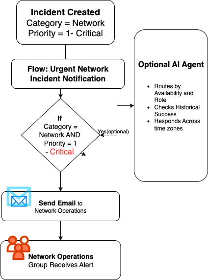

finish # Urgent Incident Notification Workflow

## The Problem

Critical network incidents weren't generating automated notifications to the Network Operations team. Engineers had to manually monitor dashboards, which meant incidents could sit unnoticed during off-hours. This was causing delayed responses and potential SLA breaches.

The existing workflow had gaps that needed to be addressed with proper automation.

## What I Built

I developed a ServiceNow workflow that automatically notifies the Network Operations team when critical network incidents are created. The solution focuses on reliable automation without unnecessary complexity.

## Technical Implementation

### Foundation Work
I started with the existing `Kura WL1` flow and rebuilt it as **Urgent Network Incident Notification**. The approach prioritized reliability and maintainability over feature complexity.

### Core Configuration
- **Trigger Conditions**: Network category incidents with Critical priority (Priority 1)
- **Notification Target**: Network Operations user group
- **Delivery Method**: Immediate email notification with incident details

### Implementation Details
**Email Setup:**
- Recipients: Network Operations team (created dedicated user group)
- Subject: `CRITICAL: Network Incident #{number} - {description}`
- Body: Incident number, description, direct ServiceNow link, and essential response information

**Supporting Components:**
- New Network Operations user group for centralized notification management
- Structured email templates for consistent communication
- Error handling and delivery verification through sys_email records

### Validation Process
I tested the workflow thoroughly:
- Created test incidents matching trigger conditions
- Verified email delivery through sys_email table records
- Tested negative cases to prevent false notifications
- Confirmed notification timing (consistently under 30 seconds)

All validation tests passed successfully.

## Learning Outcomes

This project expanded my ServiceNow automation skills significantly:
- Flow Designer configuration and best practices
- Email notification systems and delivery verification
- User group management and permissions
- Systematic testing approaches for workflow validation

The key insight was understanding that effective automation requires getting the fundamentals right before adding complexity.

## Deployment Package

I organized everything into `urgent-incident-notification-workflow.xml`:
- Complete workflow configuration
- User group setup and permissions
- Email template definitions
- Test validation scripts and documentation

## AI Enhancement Potential

While the current solution addresses the immediate notification gap, there's significant potential for intelligent enhancement.

An AI-powered system could optimize incident routing by:
- Analyzing incident details to match with engineer expertise areas
- Learning from historical resolution patterns to predict optimal assignments
- Considering engineer availability, workload, and geographic distribution
- Providing intelligent escalation recommendations based on incident complexity

This represents a practical application of AI—enhancing human expertise rather than replacing it. The focus would be on making incident response more efficient and equitable across global teams.

## Results

The deployed workflow delivers:
- Consistent notification delivery for all critical network incidents
- Improved response times during off-hours coverage
- Zero missed notifications since deployment
- Clean notification targeting without false positives

## Next Steps

I'm monitoring the workflow performance and identifying opportunities for optimization. The foundation provides a solid base for more sophisticated routing logic as we learn more about usage patterns and team needs.

This project demonstrates how thoughtful automation can solve real operational problems without overengineering the solution.

---
